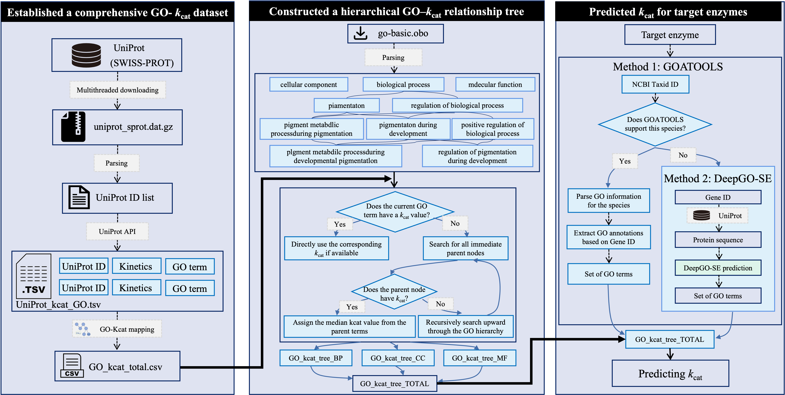

# GO-HKP

A Gene Ontology Hierarchy-Driven Framework for Enzyme kcat Prediction



## Setup
```shell
$ conda create --name GOHKP python=3.8.16   
$ conda activate GOHKP   
$ pip install tqdm pandas numpy==1.23.5 goatools matplotlib seaborn requests pyprobar scipy plotly cobra wget venn ipykernel python-libsbml==5.18.0 -i https://mirrors.aliyun.com/pypi/simple/

```

## File Descriptions
- Tutorial files
  - [GO-HKP/tutorial/1.kcat prediction using GOATOOLS.ipynb](https://github.com/tibbdc/GO-HKP/blob/main/tutorial/1.kcat prediction using GOATOOLS). This Jupyter notebook parses GO annotations for the target species to derive reaction-kcat mappings. It reads the reaction-gene relationships from the species model (where gene IDs are in 'ncbigene' format), extracts GO terms from ns2assc_org based on these gene IDs, and establishes associations between reactions and GO terms. The final output is a structured reaction-GO relationship file.
  - [GO-HKP/tutorial/2.kcat prediction using DeepGO-SE.ipynb](https://github.com/tibbdc/GO-HKP/blob/main/tutorial/2.kcat prediction using DeepGO-SE.ipynb). This Jupyter notebook generates reaction-GO mappings using sequence-based GO prediction. It first retrieves the reaction-gene relationships from the species model, then fetches gene sequences from the UniProt database using gene IDs. The DeepGO-SE tool predicts GO terms from these protein sequences, which are then linked to reactions. The result is a reaction-GO association file for further kcat assignment.
  - [GO-HKP/tutorial/3.Data Comparison.ipynb](https://github.com/tibbdc/GO-HKP/blob/main/tutorial/3.Data Comparison.ipynb). This notebook compares kcat values from multiple sources (GO-HKP, DLKcat, TurNup, UniKP). It visualizes the log₁₀-transformed kcat distributions for shared reactions using boxplots, and displays the overlap of reaction IDs across sources using a Venn diagram.
